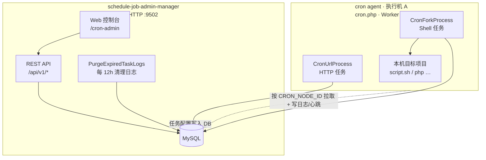

# Schedule Job

基于 [Swoolefy](https://github.com/bingcool/swoolefy) 的 **Cron 任务调度管理平台 + Agent 执行体**。提供 Web 管理控制台、REST API、多节点 Agent 拉取执行、执行日志与操作审计，适用于 PHP 生态下的分布式定时任务场景。

---

## 系统说明

Schedule Job 由两个独立部署、协同工作的子系统组成：**schedule-job-admin-manager（管理端）** 与 **cron agent（节点执行端）**。二者共用同一 MySQL 数据库，通过库表交换任务配置与执行结果。

### schedule-job-admin-manager（管理端）

管理端负责**任务的配置、权限、监控与审计**，不提供脚本执行能力。

| 项目 | 说明 |
|------|------|
| **职责** | Web 控制台、REST API、用户/角色/节点管理、任务 CRUD、执行日志与操作审计 |
| **部署位置** | 通常 1 套（或按需多副本），与业务脚本所在机器无关 |
| **启动命令** | `php cli.php start App` |
| **典型配置** | `App/.env` 中的 MySQL、JWT（`AUTH_JWT_*`）、日志保留天数（`CRON_TASK_LOG_DELETE_DAY`）等 |

在管理台创建/编辑任务后，配置写入 `cron_task` 等表；Agent 通过轮询数据库感知变更，无需管理端主动推送。

### cron agent（节点执行端）

Cron Agent 部署在**实际需要跑定时脚本的机器**上，负责本机拉取任务并执行 Shell/HTTP 调度。

| 项目 | 说明 |
|------|------|
| **职责** | 按 `CRON_NODE_ID` 拉取绑定任务、fork 执行脚本或发起 HTTP 请求、上报心跳与执行日志 |
| **部署位置** | 每台执行机各部署 1 套；多台机器 = 多个 Agent 节点 |
| **启动命令** | `php cron.php start App` |
| **必需 `.env` 配置** | `CRON_NODE_ID`、`CRON_NODE_API_KEY`、以及与管理端相同的 **DB 连接**（`DB_HOST_*` 等） |
| **可选配置** | `CRON_POLL_INTERVAL`（拉取间隔）、`CRON_HEARTBEAT_INTERVAL`（心跳间隔） |

**Agent 机器还需部署目标业务代码。** 管理台里任务的 `command` / `exec_script` 指向本机路径（如 `/home/wwwroot/your-project/script.sh`），Agent 只负责按 Cron 表达式触发执行，**不会**把代码分发到节点；脚本依赖的运行时（PHP、Python、Shell 等）也需在 Agent 机器上预先安装。

### 二者如何协作

```
管理端 (cli.php)                    MySQL                         Agent (cron.php)
     │                                │                                │
     │  创建/编辑任务 ──────────────► │ ◄──── 轮询拉取本节点任务 ─────── │
     │  查看日志 / Dashboard ◄─────── │ ────► 写入执行日志 / 心跳 ────── │
     │                                │                                │
     │                                │         在本机 fork 执行脚本      │
```

1. 在管理端 **Cron Nodes** 创建节点，获得 `node_id` 与 `api_key`（`api_key` 仅展示一次）。
2. 在 Agent 机器配置 `.env`：`CRON_NODE_ID`、`CRON_NODE_API_KEY`、DB 连接。
3. Agent 机器部署 schedule-job 代码及**待执行的 target 项目**。
4. 管理端启动：`php cli.php start App`；Agent 启动：`php cron.php start App`。
5. Agent 根据 `node_id` 拉取任务，在**当前机器**执行；执行记录回写数据库，管理端可查询。

> **注意**：管理端与 Agent **启动入口不同**（`cli.php` vs `cron.php`），默认监听端口也不同（管理端 HTTP `9502`，Agent Worker `9506`）。同一台机器上可以只跑其中一种，也可以同时跑两种（开发环境常见）；生产环境通常分开部署。

---

## 目录

- [系统说明](#系统说明)
- [功能特性](#功能特性)
- [系统架构](#系统架构)
- [技术栈](#技术栈)
- [环境要求](#环境要求)
- [快速开始](#快速开始)
- [配置说明](#配置说明)
- [启动服务](#启动服务)
- [Web 管理台](#web-管理台)
- [Agent 节点部署](#agent-节点部署)
- [权限与数据范围](#权限与数据范围)
- [API 概览](#api-概览)
- [数据库表说明](#数据库表说明)
- [目录结构](#目录结构)
- [运维说明](#运维说明)
- [常见问题](#常见问题)
- [License](#license)

---

## 功能特性

### 任务调度

- **Shell / Fork 任务**（`exec_type = 1`）：在 Agent 节点上 fork 子进程执行脚本或命令
- **HTTP 任务**（`exec_type = 2`）：按 Cron 表达式定时发起 HTTP 请求
- 支持 Cron 表达式、允许/跳过时间段（`cron_between` / `cron_skip`）
- 支持阻塞重叠执行（`with_block_lapping`）、失败重试（`retry`）
- 支持**手动执行一次**（Run Once），跨进程入队后由 Worker 消费

### 多节点 Agent

- 节点注册、分组管理、心跳上报
- 每个节点独立 `node_id` + `api_key` 鉴权
- Worker 定时轮询 DB 拉取本节点任务，Runtime Diff 动态增删改调度
- Admin 与 Agent 可分离部署（Admin 写库，Agent 读库执行）

### 可观测性

- **执行记录**（`cron_task_log`）：批次 ID、状态、耗时、退出码 / HTTP 状态等
- **Dashboard**：任务统计、今日执行趋势、节点在线状态
- **操作审计**（`cron_task_operation_log`）：启用 / 禁用 / 删除 / 执行 / 编辑的前后快照
- 过期执行日志自动硬删除（可配置保留天数）

### 权限管理（RBAC）

- JWT 登录鉴权
- 角色、菜单页面权限
- **节点组授权**：非超管用户仅可见授权节点组下的任务与日志
- 内置角色：`super_admin`（超管）、`editer_task_group`（可维护他人创建的任务）

---

## 系统架构

（组件分工见上文 [系统说明](#系统说明)。）



| 子系统 | 入口 | 启动命令 | 默认端口 | 职责 |
|--------|------|----------|----------|------|
| **schedule-job-admin-manager** | `cli.php` | `php cli.php start App` | `9502` | Web UI、管理 API、JWT 鉴权、日志清理 |
| **cron agent** | `cron.php` | `php cron.php start App` | `9506` | 拉取本节点任务、本机执行脚本/HTTP、心跳上报 |

> 端口在各自入口文件的 `APP_META_ARR` 中配置，可按环境修改。应用名 `App` 需与 `cli.php` / `cron.php` 中定义一致（区分大小写）。

---

## 技术栈

| 类别 | 选型 |
|------|------|
| 语言 | PHP 8.x |
| 框架 | [bingcool/swoolefy](https://github.com/bingcool/swoolefy) 6.2.x |
| 运行时 | Swoole 扩展 |
| 数据库 | MySQL 5.7+ / 8.x |
| 鉴权 | JWT（HS256） |
| 前端 | Vue 2 + Vue Router（静态 SPA，内置于 `App/Module/Cron/static/cron-admin`） |

---

## 环境要求

- PHP >= 8.1（推荐 8.2+）
- 扩展：`swoole`、`pdo_mysql`、`json`、`mbstring`、`openssl`
- Composer 2.x
- MySQL 5.7+ 或 8.x
- Linux / macOS（生产环境建议 Linux）

---

## 快速开始

### 1. 克隆与安装依赖

```bash
git clone <your-repo-url> schedule-job
cd schedule-job
composer install
```

### 2. 配置环境变量

```bash
cp App/.env.example App/.env
# 编辑 App/.env，至少配置 MySQL 与 JWT
```

### 3. 初始化数据库

按顺序执行迁移脚本（在目标库中）：

```bash
mysql -h <host> -u <user> -p <database> < migrations/permission.sql
mysql -h <host> -u <user> -p <database> < migrations/cron.sql
```

迁移完成后会预置**超级管理员**账号，用于首次登录：

| 项目 | 值 |
|------|-----|
| 账号 | `admin` |
| 密码 | `123456789` |
| 角色 | `super_admin`（超级管理员） |

> **安全提示**：部署完成后请立即使用上述账号登录，并在「用户管理」中修改密码。生产环境切勿保留默认密码。

系统**已关闭公开注册**，新用户只能由超级管理员或有权限的管理员在后台 **用户管理** 中创建。

### 4. 启动管理端（schedule-job-admin-manager）

```bash
# 前台启动
php cli.php start App

# 守护进程模式
php cli.php start App --daemon=1
```

### 5. 访问管理台

浏览器打开：

```
http://127.0.0.1:9502/cron-admin
```

使用默认超级管理员登录：**账号 `admin`，密码 `123456789`**（见上文数据库初始化）。登录后建议在用户管理中修改密码。

### 6. 创建节点并启动 Cron Agent

1. 在管理台 **Cron Nodes** 中创建节点，记录返回的 `apiKey`（仅展示一次）
2. 在**执行机**配置 `.env`（`CRON_NODE_ID`、`CRON_NODE_API_KEY`、DB），并部署目标业务代码
3. 启动 Agent：

```bash
php cron.php start App
```

---

## 配置说明

主配置文件：`App/.env`（参考 `App/.env.example`）。

### 数据库

| 变量 | 说明 |
|------|------|
| `DB_HOST_NAME` | MySQL 主机 |
| `DB_HOST_PORT` | 端口，默认 `3306` |
| `DB_HOST_DATABASE` | 库名 |
| `DB_USER_NAME` | 用户名 |
| `DB_PASSWORD` | 密码 |

### 鉴权

| 变量 | 说明 |
|------|------|
| `AUTH_JWT_SECRET` | JWT 密钥（**生产必改**） |
| `AUTH_JWT_TTL` | Token 有效期（秒），默认 `7200` |
| `AUTH_JWT_ALGO` | 算法，默认 `HS256` |

### Cron / Agent

| 变量 | 说明 |
|------|------|
| `CRON_NODE_ID` | 当前 Agent 节点 ID（每台机器不同） |
| `CRON_NODE_API_KEY` | 节点 API Key（创建节点时获得） |
| `CRON_POLL_INTERVAL` | Worker 轮询 DB 间隔（秒），默认 `20` |
| `CRON_HEARTBEAT_INTERVAL` | 心跳间隔（秒），默认 `15` |
| `CRON_DEBUG` | Cron 调试开关 |
| `CRON_TASK_LOG_DELETE_DAY` | 执行日志保留天数，默认 `7`；≤0 表示不自动清理 |

### 其他

| 变量 | 说明 |
|------|------|
| `ENABLE_LOG_SANITIZE` | 日志脱敏（password/token 等），生产建议开启 |

更多配置见 `App/Config/`（健康检查、限流、文件存储等）。

---

## 启动服务

管理端与 Cron Agent **入口与命令不同**，请勿混用。

### schedule-job-admin-manager（管理端）

```bash
php cli.php start App              # 前台
php cli.php start App --daemon=1   # 守护进程
php cli.php stop App               # 停止
php cli.php restart App            # 重启
php cli.php reload App             # 平滑重载 Worker
php cli.php status App             # 状态
```

### cron agent（节点执行端）

```bash
php cron.php start App
php cron.php stop App
php cron.php restart App
php cron.php status App
```

Agent Worker 进程配置位于：

- `App/WorkerCron/worker_cron_conf.php` — 总入口
- `App/WorkerCron/conf/schedule_fork_conf.php` — Shell 任务
- `App/WorkerCron/conf/schedule_url_conf.php` — HTTP 任务

### 健康检查

HTTP 服务默认暴露（可在 `App/Config/health.php` 调整）：

| 路径 | 用途 |
|------|------|
| `/health` | Liveness |
| `/ready` | Readiness |

---

## Web 管理台

入口：`http://<host>:9502/cron-admin`

| 页面 | 路径 | 说明 |
|------|------|------|
| Dashboard | `#/dashboard` | 任务与执行概览 |
| 计划任务 | `#/tasks` | 任务 CRUD、启停、手动执行 |
| 操作记录 | `#/tasks/operation-logs` | 任务变更审计 |
| 执行记录 | `#/executions` | 按任务 / 状态 / 批次筛选 |
| Cron Nodes | `#/nodes` | 节点与分组管理 |
| Runtime | `#/runtime` | Worker 运行时概览 |
| 用户 / 角色 / 菜单 | `#/users` 等 | RBAC 管理 |

---

## Agent 节点部署

Cron Agent 部署在需要执行定时脚本的机器上。每台机器独立配置 `CRON_NODE_ID`，并需提前部署好**任务所要执行的目标代码项目**（管理台中的命令/脚本路径指向本机实际路径）。

### 部署模型

- **schedule-job-admin-manager**：1 套（或多副本），`php cli.php start App`
- **cron agent**：每台执行机 1 套，`php cron.php start App`，通过 `CRON_NODE_ID` 区分节点

### 配置步骤

1. **在管理端创建节点**  
   `POST /api/v1/nodes` → 响应含 `apiKey`（请立即保存）

2. **在 Agent 机器配置 `.env`**（DB 配置需能连到与管理端相同的库）

```env
# 数据库（与管理端共用）
DB_HOST_NAME=192.168.1.102
DB_HOST_DATABASE=schedule_job
DB_USER_NAME=root
DB_PASSWORD=******
DB_HOST_PORT=3306

# 本 Agent 节点身份（每台机器不同）
CRON_NODE_ID=1
CRON_NODE_API_KEY=<创建节点时返回的 apiKey>

CRON_POLL_INTERVAL=20
CRON_HEARTBEAT_INTERVAL=15
```

3. **部署目标业务代码**  
   例如任务命令为 `/home/wwwroot/my-app/bin/run.sh`，则 Agent 机器上必须存在该路径及可执行环境。

4. **启动 Cron Agent**

```bash
php cron.php start App          # 前台
php cron.php start App --daemon=1   # 守护进程
```

### 任务拉取方式

Worker 通过 `CronTaskService::fetchCronTask()` 从 DB 拉取本节点、未软删的任务（含禁用任务，由 Runtime Diff 处理启停）。也可通过 HTTP 调试：

```bash
curl 'http://127.0.0.1:9502/api/v1/agent/tasks?nodeId=1&apiKey=YOUR_API_KEY&execType=1'
```

| 参数 | 说明 |
|------|------|
| `nodeId` | 节点 ID |
| `apiKey` | 节点密钥 |
| `execType` | 可选：`1`=Shell，`2`=HTTP；省略则返回两类 |

---

## 权限与数据范围

### 认证

- 管理 API 需 Header：`Authorization: Bearer <jwt>`
- 登录：`POST /api/v1/auth/login`
- **公开注册已关闭**：新用户由管理员在 **用户管理** 中创建（`POST /api/v1/users`）
- 默认超级管理员：`admin` / `123456789`（导入 `migrations/permission.sql` 后可用，生产环境请立即改密）

### 内置角色

| code | 说明 |
|------|------|
| `super_admin` | 超级管理员，不受节点组限制 |
| `editer_task_group` | 可编辑任意可见任务（不限创建人） |

### 数据范围

- 普通用户通过 **节点组授权**（`staff_user_relate_node_group`）限定可见的节点、任务、日志
- 任务创建人默认可管理自己创建的任务；`editer_task_group` 与超管可管理他人任务
- 菜单与 API 访问受角色-页面权限控制（`MenuPagePermissionMiddleware`）

---

## API 概览

基础前缀：`/api/v1`（管理端默认 `http://127.0.0.1:9502`）

### 认证

| 方法 | 路径 | 说明 |
|------|------|------|
| POST | `/auth/login` | 登录 |
| GET | `/auth/me` | 当前用户 |

### 任务

| 方法 | 路径 | 说明 |
|------|------|------|
| GET | `/tasks` | 分页列表 |
| GET | `/tasks/creators` | 创建人筛选项 |
| POST | `/tasks` | 创建 |
| PUT | `/tasks` | 更新 |
| DELETE | `/tasks` | 删除 |
| POST/PUT | `/tasks/status` | 启停 |
| PUT | `/tasks/batch-status` | 批量启停 |
| GET | `/tasks/detail` | 详情 |
| POST | `/tasks/run` | 手动执行 |
| POST | `/tasks/duplicate` | 复制任务 |
| POST | `/tasks/expression/preview` | 表达式预览 |
| GET | `/tasks/execution` | 单次执行详情 |
| GET | `/tasks/logs` | 执行日志分页 |
| GET | `/tasks/stats` | 任务统计 |
| GET | `/tasks/operation-logs` | 操作审计 |
| GET | `/tasks/operation-logs/operators` | 操作人筛选项 |

### 节点

| 方法 | 路径 | 说明 |
|------|------|------|
| GET/POST/PUT/DELETE | `/nodes` | 节点 CRUD |
| GET/POST/PUT/DELETE | `/node-groups` | 节点分组 CRUD |

### Dashboard

| 方法 | 路径 | 说明 |
|------|------|------|
| GET | `/dashboard/overview` | 概览 |
| GET | `/dashboard/execution-trend` | 执行趋势 |
| GET | `/runtime/overview` | Runtime 概览 |

### Agent（无需 JWT，需 apiKey）

| 方法 | 路径 | 说明 |
|------|------|------|
| GET | `/agent/tasks` | 拉取任务列表 |
| POST | `/agent/heartbeat` | 心跳 |
| POST | `/agent/report` | 状态上报 |

### 任务字段要点

| 字段 | 说明 |
|------|------|
| `name` | 任务名称（唯一） |
| `expression` | Cron 表达式 |
| `command` | Shell 命令或 HTTP URL |
| `exec_type` | `1`=Shell，`2`=HTTP |
| `node_id` | 绑定 Agent 节点 |
| `status` | `0` 禁用，`1` 启用 |
| `with_block_lapping` | `1` 时阻塞重叠执行 |
| `retry` | 失败后额外重试次数 |
| `http_method` / `http_body` / `http_headers` | HTTP 任务专用 |

更完整的请求示例见 `App/Module/Cron/Controller/CronTaskManagerController.php` 中各方法的 curl 注释。

---

## 数据库表说明

| 表名 | 说明 |
|------|------|
| `cron_task` | 定时任务定义 |
| `cron_agent_node` | Agent 节点（含 `api_key`、心跳） |
| `cron_agent_node_group` | 节点分组 |
| `cron_task_run_request` | 手动执行请求队列 |
| `cron_task_log` | 执行记录 |
| `cron_task_operation_log` | 操作审计 |
| `staff_user` | 用户 |
| `staff_roles` | 角色 |
| `staff_menu_pages` | 菜单页面 |
| `staff_role_page` | 角色-页面 |
| `staff_user_role` | 用户-角色 |
| `staff_user_relate_node_group` | 用户-节点组 |

迁移脚本：`migrations/cron.sql`、`migrations/permission.sql`。

---

## 目录结构

```
schedule-job/
├── App/
│   ├── Config/                 # 应用配置（db、auth、health…）
│   ├── Controller/             # 公共控制器
│   ├── Module/
│   │   ├── Cron/               # Cron 管理模块
│   │   │   ├── Controller/     # API / 静态资源
│   │   │   ├── Service/        # 业务逻辑
│   │   │   ├── Entity/         # 数据实体
│   │   │   ├── Dto/            # 数据传输对象
│   │   │   └── static/         # Web 前端静态文件
│   │   └── Staff/              # 用户 / 角色 / 权限
│   ├── Process/                # 自定义 Swoole 进程
│   │   └── PurgeExpiredTaskLogs.php  # 过期日志清理
│   ├── Router/                 # 路由定义
│   │   └── Module/
│   │       ├── CronManager.php
│   │       └── StaffManager.php
│   ├── WorkerCron/             # Agent Worker 配置
│   │   ├── MainCronProcess.php
│   │   └── conf/
│   ├── Event.php               # 应用生命周期钩子
│   └── .env                    # 环境变量（不提交 Git）
├── migrations/                 # SQL 迁移
├── cli.php                     # HTTP 管理服务入口
├── cron.php                    # Cron Worker 入口
├── composer.json
└── README.md
```

---

## 运维说明

### 执行日志清理

`App/Process/PurgeExpiredTaskLogs` 随 HTTP 管理服务启动（见 `App/Event.php`）：

- 启动后立即执行一次
- 之后每 **12 小时**执行一次
- 硬删除 `created_at` 早于 `CRON_TASK_LOG_DELETE_DAY` 天的 `cron_task_log` 记录

### 进程与日志路径

Swoolefy 默认 PID / 控制日志目录：

```
/tmp/workerfy/log/<service-name>/
```

### 生产建议

- 修改 `AUTH_JWT_SECRET`，开启 `ENABLE_LOG_SANITIZE`
- 首次部署后立即修改默认超管密码（`admin` / `123456789`）
- Admin 与 Agent 使用同一 MySQL，Agent 仅需读任务 + 写日志/心跳
- 为 `cron_task_log.created_at` 保留合理天数，避免表过大
- 使用 `--daemon=1` + 进程监控（systemd / supervisord / K8s）
- 配置 `/health`、`/ready` 探针

---

## 常见问题

**Q: 管理台能打开，但任务一直不执行？**  
A: 确认 Agent Worker（`cron.php`）已启动；`CRON_NODE_ID` / `CRON_NODE_API_KEY` 与 Admin 中节点一致；任务 `node_id` 匹配且 `status=1`。

**Q: Agent 拉任务报「节点不存在或凭证无效」？**  
A: 检查 `apiKey` 是否与 `cron_agent_node.api_key` 一致；节点未被软删。

**Q: 修改 `.env` 后不生效？**  
A: 重启对应服务：`php cli.php restart App` 或 `php cron.php restart App`。

**Q: 非超管看不到任务？**  
A: 在用户管理中为用户授权对应 **节点组**，且任务所属节点在该组内。

**Q: 静态资源 404？**  
A: 新增前端 JS/CSS 需加入 `CronAdminController` 的白名单 `$allowed`。

---

## License

MIT — 详见 [composer.json](composer.json)。
